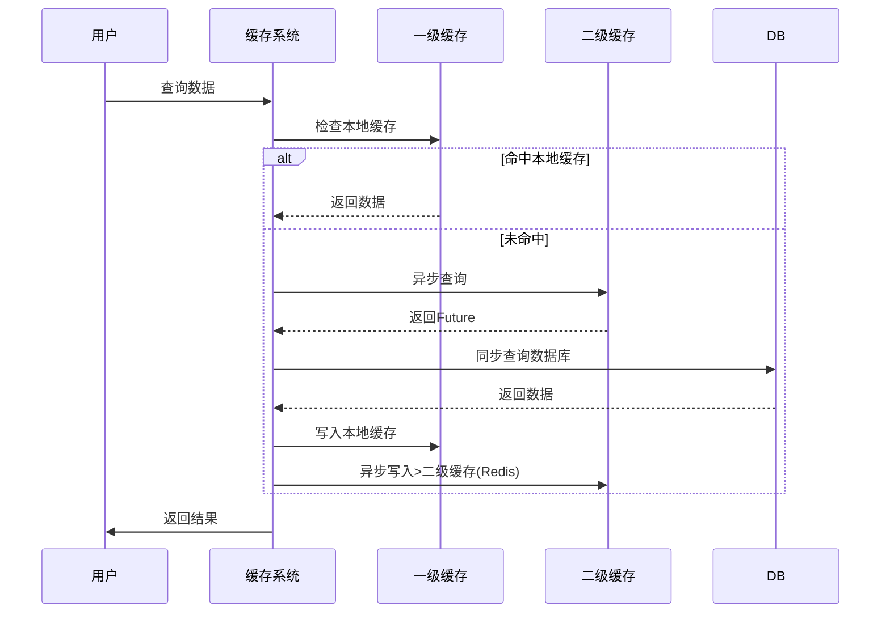

## [About](README.md)

<h1 align="center">tiered-cache</h1>

[](https://github.com/dawndev/tiered-cache)


<div align="center">

一个基于 `Caffeine` 和 `Redisson` 实现的轻量级分布式缓存框架。它提供了统一的缓存管理接口，并解决了分布式环境下的缓存一致性、缓存击穿、缓存雪崩等常见问题。


```

[业务调用] → L1 (默认Caffeine) → 同步检查 → 未命中 → L2 (默认Redis) → 异步查询 → DB
                                     ↑ 异步回填         ↑ 异步更新


```

</div>

## Function
异步操作实现：
- 支持独立线程池处理IO密集型任务
- 支持链式异步调用（thenApply/thenAccept）

缓存一致性保障：
- 更新时采用"先更新DB，再删除缓存"模式
- 通过Redis Pub/Sub广播失效本地缓存
- 使用Write Behind模式异步更新二级缓存

性能优化点：
- Caffeine使用Window TinyLFU淘汰策略
- Redis连接池复用TCP连接
- 异步操作使用独立线程池隔离资源

容错机制：
- 异步操作异常捕获处理
- 本地缓存失效降级策略

## Compile

如果你想要编译本项目, 你可能需要提前准备以下环境

| Target      | Version |
| ----------- |---------|
| JDK      | 11      |
| Kotlin   | 1.6.21  |
| Gradle   | 7.5.1   |

编译
```bash
gradlew clean buid
```

---

